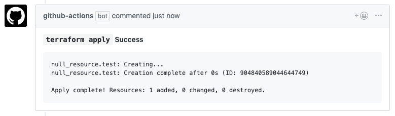

# Terraform GitHub Actions
These official Terraform GitHub Actions allow you to run `terraform fmt`, `validate`, `plan` and `apply` on your pull requests to help you review, validate and apply Terraform changes.

## Getting Started
To get started, check out our documentation: [https://www.terraform.io/docs/github-actions/getting-started/](https://www.terraform.io/docs/github-actions/getting-started/).

## Actions

### Fmt Action
Runs `terraform fmt` and comments back if any files are not formatted correctly.

### Validate Action
Runs `terraform validate` and comments back on error.

### Plan Action
Runs `terraform plan` and comments back with the output.

### Apply Action
Runs `terraform apply` and comments back with the output.
