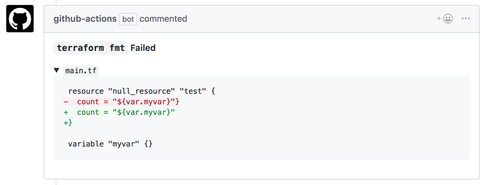
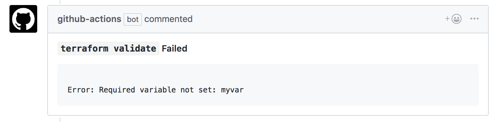
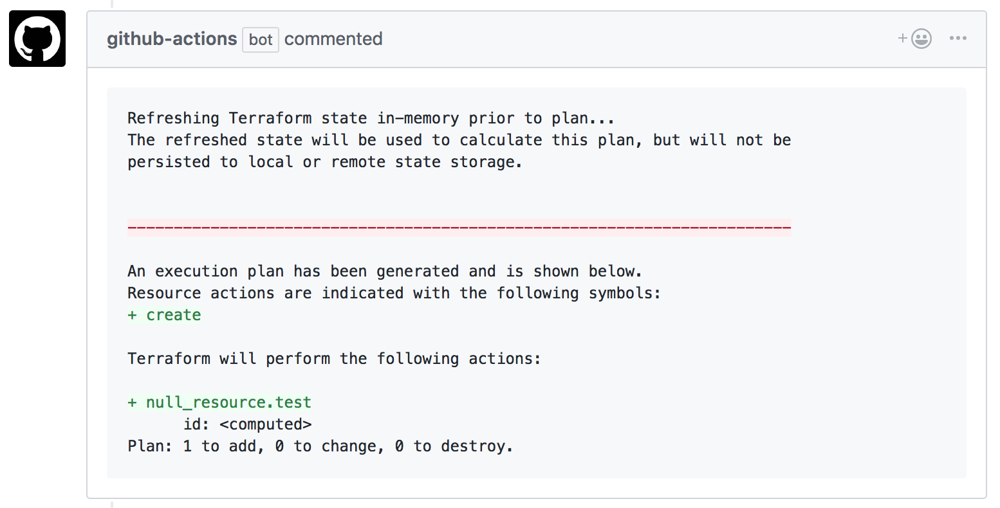

# Terraform GitHub Actions
These official Terraform GitHub Actions allow you to run `terraform fmt`, `validate` and `plan` on your pull requests to help you review and validate Terraform changes.

* [Actions](#actions)
  * [Fmt Action](#fmt-action)
  * [Validate Action](#validate-action)
  * [Plan Action](#plan-action)
* [Usage](#usage)
  * [Recommended Workflow](#recommended-workflow)
    * [Step 1 - Create the initial workflow](#step-1---create-the-initial-workflow)
    * [Step 2 - Customize it for your use-case](#step-2---customize-it-for-your-use-case)
  * [Compose Your Own Workflow](#compose-your-own-workflow)
* [Directories](#directories)
* [Workspaces](#workspaces)

## Actions

### Fmt Action
Runs `terraform fmt` and comments back if any files are not formatted correctly.


### Validate Action
Runs `terraform validate` and comments back on error.


### Plan Action
Runs `terraform plan` and comments back with the output.


## Usage
To add these actions to your pull requests, you can copy our [recommended workflow](#recommended-workflow) into your `.github/main.workflow` file or you can [write your own workflow](#compose-your-own-workflow).

### Recommended Workflow
This workflow will run `terraform fmt`, `init`, `validate` and `plan`. To use it:

#### Step 1 - Create the initial workflow
1. Open up your repository in GitHub and click on the **Actions** tab
1. Click **Create a new workflow**
1. Click **<> Edit new file**
1. Paste the contents below into the file
    <details><summary>Show</summary>
      
    ```workflow
    workflow "Terraform" {
      resolves = "terraform-plan"
      on = "pull_request"
    }
    
    action "filter-to-pr-open-synced" {
      uses = "docker://superbbears/filter:0.2.0"
      args = ["action", "opened|synchronize"]
    }
    
    action "terraform-fmt" {
      uses = "hashicorp/terraform-github-actions/fmt@v0.1"
      needs = "filter-to-pr-open-synced"
      secrets = ["GITHUB_TOKEN"]
      env = {
        TF_ACTION_WORKING_DIR = "."
      }
    }
    
    action "terraform-init" {
      uses = "hashicorp/terraform-github-actions/init@v0.1"
      needs = "terraform-fmt"
      secrets = ["GITHUB_TOKEN"]
      env = {
        TF_ACTION_WORKING_DIR = "."
      }
    }
    
    action "terraform-validate" {
      uses = "hashicorp/terraform-github-actions/validate@v0.1"
      needs = "terraform-init"
      secrets = ["GITHUB_TOKEN"]
      env = {
        TF_ACTION_WORKING_DIR = "."
      }
    }
    
    action "terraform-plan" {
      uses = "hashicorp/terraform-github-actions/plan@v0.1"
      needs = "terraform-validate"
      secrets = ["GITHUB_TOKEN"]
      env = {
        TF_ACTION_WORKING_DIR = "."
        # If you're using Terraform workspaces, set this to the workspace name.
        TF_ACTION_WORKSPACE = "default"
      }
    }
    ```
    </details>
   
#### Step 2 - Customize it for your use-case
1. If your Terraform is in a different directory that the root of your repo, replace all instances of
    ```
    TF_ACTION_WORKING_DIR = "."
    ```
    With your directory, relative to the root of the repo, ex.
    ```
    TF_ACTION_WORKING_DIR = "./terraform"
    ```
    If you have multiple directories of Terraform code see [Directories](#directories)
1. If your Terraform runs in a different [workspace](https://www.terraform.io/docs/state/workspaces.html) than `default`, also change the `TF_ACTION_WORKSPACE` environment variable in the `terraform-plan` action.

   If you have multiple workspaces, see [Workspaces](#workspaces).
1. If you're using a Terraform provider that requires credentials to run `terraform plan` (like AWS or Google Cloud Platform) then you need to add those credentials as Secrets to the `terraform-plan` action. Secrets can only be added from the **Visual Editor** so click back to that tab.
1. Scroll down to the `terraform-plan` action and click **Edit**. This will open up the action editor on the right side where you'll be able to add your secrets, ex. `AWS_ACCESS_KEY_ID` and `AWS_SECRET_ACCESS_KEY`. See your [Provider Documentation](https://www.terraform.io/docs/providers/) for how to use environment variables with your provider. 

    ⚠️ WARNING ⚠️ These secrets could be exposed if the plan action is run on a malicious Terraform file. As a result, we recommend you do not use this action on public repos or repos where untrusted users can submit pull requests.


## Compose Your Own Workflow
If you'd like to compose your own workflow, you can use each action separately. Each action is documented:
* [fmt](fmt/)
* [init](init/)
* [validate](validate/)
* [plan](plan/)

## Directories
Currently, these actions only support running in a single directory. If you'd like to run them in multiple directories, you'll have to create separate workflows for each directory:

<details><summary>Show</summary>

```workflow
workflow "terraform-dir1" {
  resolves = "terraform-plan-dir1"
  on       = "pull_request"
}

action "filter-to-pr-open-synced" {
  uses = "docker://superbbears/filter:0.2.0"
  args = ["action", "opened|synchronize"]
}

action "terraform-fmt-dir1" {
  uses    = "hashicorp/terraform-github-actions/fmt@v0.1"
  needs   = "filter-to-pr-open-synced"
  secrets = ["GITHUB_TOKEN"]

  env = {
    TF_ACTION_WORKING_DIR = "dir1"
  }
}

action "terraform-init-dir1" {
  uses    = "hashicorp/terraform-github-actions/init@v0.1"
  secrets = ["GITHUB_TOKEN"]
  needs   = "terraform-fmt-dir1"

  env = {
    TF_ACTION_WORKING_DIR = "dir1"
  }
}

action "terraform-validate-dir1" {
  uses    = "hashicorp/terraform-github-actions/validate@v0.1"
  secrets = ["GITHUB_TOKEN"]
  needs   = "terraform-init-dir1"

  env = {
    TF_ACTION_WORKING_DIR = "dir1"
  }
}

action "terraform-plan-dir1" {
  uses    = "hashicorp/terraform-github-actions/plan@v0.1"
  needs   = "terraform-validate-dir1"
  secrets = ["GITHUB_TOKEN"]

  env = {
    TF_ACTION_WORKING_DIR = "dir1"
  }
}

workflow "terraform-dir2" {
  resolves = "terraform-plan-dir2"
  on       = "pull_request"
}

action "terraform-fmt-dir2" {
  uses    = "hashicorp/terraform-github-actions/fmt@v0.1"
  needs   = "filter-to-pr-open-synced"
  secrets = ["GITHUB_TOKEN"]

  env = {
    TF_ACTION_WORKING_DIR = "dir2"
  }
}

action "terraform-init-dir2" {
  uses    = "hashicorp/terraform-github-actions/init@v0.1"
  secrets = ["GITHUB_TOKEN"]
  needs   = "terraform-fmt-dir2"

  env = {
    TF_ACTION_WORKING_DIR = "dir2"
  }
}

action "terraform-validate-dir2" {
  uses    = "hashicorp/terraform-github-actions/validate@v0.1"
  secrets = ["GITHUB_TOKEN"]
  needs   = "terraform-init-dir2"

  env = {
    TF_ACTION_WORKING_DIR = "dir2"
  }
}

action "terraform-plan-dir2" {
  uses    = "hashicorp/terraform-github-actions/plan@v0.1"
  needs   = "terraform-validate-dir2"
  secrets = ["GITHUB_TOKEN"]

  env = {
    TF_ACTION_WORKING_DIR = "dir2"
  }
}
```
</details>

## Workspaces
Currently, these actions only support running in a single [Terraform workspace](https://www.terraform.io/docs/state/workspaces.html).

NOTE: The only action workspaces affect is `plan`.

If you'd like to run in multiple workspaces, you need to create separate workflows for each workspace. Since the only action that uses workspaces is `plan`, you can share the rest of the `fmt`, `init` and `validate` actions between the two workflows:

<details><summary>Show</summary>

```workflow
workflow "terraform-workspace1" {
  resolves = "terraform-plan-workspace1"
  on       = "pull_request"
}

workflow "terraform-workspace2" {
  resolves = "terraform-plan-workspace2"
  on       = "pull_request"
}

action "filter-to-pr-open-synced" {
  uses = "docker://superbbears/filter:0.2.0"
  args = ["action", "opened|synchronize"]
}

action "terraform-fmt" {
  uses    = "hashicorp/terraform-github-actions/fmt@v0.1"
  needs   = "filter-to-pr-open-synced"
  secrets = ["GITHUB_TOKEN"]
}

action "terraform-init" {
  uses    = "hashicorp/terraform-github-actions/init@v0.1"
  secrets = ["GITHUB_TOKEN"]
  needs   = "terraform-fmt"
}

action "terraform-validate" {
  uses    = "hashicorp/terraform-github-actions/validate@v0.1"
  secrets = ["GITHUB_TOKEN"]
  needs   = "terraform-init"
}

action "terraform-plan-workspace1" {
  uses    = "hashicorp/terraform-github-actions/plan@v0.1"
  needs   = "terraform-validate"
  secrets = ["GITHUB_TOKEN"]

  env = {
    TF_ACTION_WORKSPACE = "workspace1"
  }
}

action "terraform-plan-workspace2" {
  uses    = "hashicorp/terraform-github-actions/plan@v0.1"
  needs   = "terraform-validate"
  secrets = ["GITHUB_TOKEN"]

  env = {
    TF_ACTION_WORKSPACE = "workspace2"
  }
}
```
</details>
